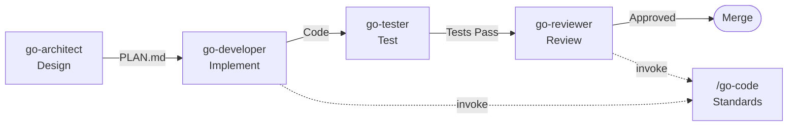

# `gosmith`

A Claude Code plugin providing specialized agents and skills for Go development, infrastructure, and workflow automation.

## Installation

Add the marketplace and install the plugin:

```shell
/plugin marketplace add otaviof/gosmith
/plugin # Search and install "gosmith"
```

As well, non-interactively with the command line:

```bash
claude plugin marketplace add otaviof/gosmith
claude plugin install gosmith
```

### Local Development

Test the plugin locally without installing:

```bash
claude --plugin-dir ${PWD}
```

## Permissions

Claude Code agents cannot declare their own tool permissions ([#10093](https://github.com/anthropics/claude-code/issues/10093)). Configure permissions in your project's `.claude/settings.local.json` so agents can run read-only and build commands without repeated approval prompts.

Recommended settings for Go projects:

```json
{
  "permissions": {
    "allow": [
      "Bash(cat:*)",
      "Bash(find:*)",
      "Bash(head:*)",
      "Bash(ls:*)",
      "Bash(make:*)",
      "Bash(pwd)",
      "Bash(tail:*)",
      "Bash(tree:*)",
      "Bash(wc:*)",
      "Bash(which:*)",
      "Bash(go:*)",
      "Bash(golangci-lint:*)",
      "Bash(git branch:*)",
      "Bash(git diff:*)",
      "Bash(git log:*)",
      "Bash(git merge-base:*)",
      "Bash(git rev-parse:*)",
      "Bash(git show:*)",
      "Bash(git status:*)"
    ]
  }
}
```

Extend with additional patterns as needed (e.g., `Bash(kubectl:*)`, `Bash(oc:*)`, `Bash(gh:*)`). Any unmatched Bash command will prompt for approval.

**Important:** A catch-all `"ask": ["Bash"]` in global settings (`~/.claude/settings.json`) will intercept all Bash commands before project-level `allow` rules are evaluated. Remove it if you use project-level allow patterns.

## What's Included

| Type       | Count | Examples                                           |
| ---------- | ----- | -------------------------------------------------- |
| **Agents** | 11    | go-architect, go-developer, tekton-expert, gha-expert |
| **Skills** | 7     | /go-check, /go-cover, /ginkgo, /jira, /make        |

## Go Development Workflow



## Quick Start

After installing the plugin, agents and skills are available in Claude Code.

### Using Agents

Invoke agents with `@agent-name` or the fully qualified `@gosmith:agent-name`:

```
# Design a new feature
@gosmith:go-architect Design a caching layer with Redis backend

# Implement the plan
@gosmith:go-developer Implement caching layer per PLAN.md

# Write tests
@gosmith:go-tester Write tests for caching layer, target 80% coverage

# Review before merge
@gosmith:go-reviewer Review caching implementation for security and correctness
```

### Using Skills

Invoke skills with `/skill-name` or `/gosmith:skill-name`:

```
# Run Go verification pipeline
/gosmith:go-check

# Generate coverage report
/gosmith:go-cover ./...

# Fetch Jira ticket as markdown
/gosmith:jira PROJ-1234

# Run Makefile target
/gosmith:make test
```

### List Available Components

```bash
# List all agents from this plugin
claude agents | grep gosmith

# List all skills from this plugin
claude skills | grep gosmith
```

## Agents

### Go Development

| Agent            | Purpose                                                                                                  |
| ---------------- | -------------------------------------------------------------------------------------------------------- |
| **go-architect** | Creates `PLAN.md` blueprints with interfaces, data models, and steps. Invoke first for design decisions. |
| **go-developer** | Implements production Go code from plans or handles simple tasks directly.                               |
| **go-tester**    | Writes adversarial tests, fuzz tests, and benchmarks. Validates against PLAN.md contracts.               |
| **go-reviewer**  | Reviews PRs for correctness, security, and plan compliance. Invoke before merging.                       |

### Infrastructure & CI/CD

| Agent                | Purpose                                                                                      |
| -------------------- | -------------------------------------------------------------------------------------------- |
| **openshift-expert** | Kubernetes and OpenShift cluster specialist for platform administration and security.        |
| **tekton-expert**    | Tekton and Kubernetes-native CI/CD specialist for pipelines, GitOps, and automated delivery. |
| **gha-expert**       | GitHub Actions specialist for workflows, CI/CD automation, and GitHub-native DevSecOps.      |

### Utility

| Agent               | Purpose                                                                                                   |
| ------------------- | --------------------------------------------------------------------------------------------------------- |
| **context-manager** | Maintains state across multi-agent workflows and sessions. Use for complex projects exceeding 10k tokens. |
| **agent-expert**    | Creates and optimizes new Claude Code agents. Use when designing custom agents.                           |
| **skill-expert**    | Designs and optimizes token-efficient Claude Skills. Use when creating or managing skills.                |
| **tech-writer**     | Produces README, API docs, and architecture documentation. Use after implementation is stable.            |

### Shared Policies

These are referenced by other agents, not invoked directly:

| File              | Purpose                                                            |
| ----------------- | ------------------------------------------------------------------ |
| **mcrf**          | [Meta-Cognitive Reasoning Framework](agents/mcrf.md) for all agents. |
| **go-common**     | Shared policies and standards referenced by all Go agents.         |
| **infra-common**  | Collaboration patterns for openshift-expert and tekton-expert.     |
| **cicd-common**   | DevSecOps, secrets, and container build standards for CI/CD agents. |
| **execution-discipline** | [Behavioral guardrails](agents/execution-discipline.md) for all agents (scope, simplicity, verification). |
| **claude-common** | Shared policies for Claude Code extensibility (skills vs. agents). |

## Skills

Skills are discrete, repeatable tasks invoked via `/skill-name`. Unlike agents, skills are stateless and optimized for minimal token usage.

| Skill              | Purpose                                                    |
| ------------------ | ---------------------------------------------------------- |
| **/go-check**      | Run Go verification pipeline (build + test + vet + lint).  |
| **/go-cover**      | Generate Go test coverage report with package breakdown.   |
| **/ginkgo**        | Run Ginkgo BDD tests with Kubernetes-aligned conventions.  |
| **/go-code**       | Go code quality standards, idioms, and YAGNI/KISS.         |
| **/jira**          | Retrieve a Jira ticket and convert to markdown.            |
| **/make**          | Run or discover Makefile targets for build automation.     |
| **/agent-persona** | 5-element persona framework for defining agent identities. |

## Go Development Workflow

```
User Request → go-architect → go-developer → go-tester → go-reviewer → Merge
```

1. **go-architect** - Design first. Creates `PLAN.md` with interfaces and implementation steps.
2. **go-developer** - Implements code following the plan. Updates step status as work progresses.
3. **go-tester** - Validates implementation with tests and coverage analysis.
4. **go-reviewer** - Reviews for correctness and plan compliance before merge.

Skip the architect for simple tasks (bug fixes, single-file changes).

## Using context-manager

The context-manager agent preserves state across multiple agent invocations and long sessions. Use it proactively for complex workflows.

### How Context Flows Between Agents

Each agent invocation is independent—context does not automatically flow between them. Context persists through two mechanisms:

1. **PLAN.md files** — The go-architect creates `PLAN.md` which subsequent Go agents read automatically. This handles most workflow context.

2. **context-manager output** — For context not captured in `PLAN.md` (decisions, rationale, blockers), **copy the context-manager output and paste it into your next agent prompt**.

For simple workflows, `PLAN.md` is sufficient. Use context-manager for:
- Complex multi-session projects
- Preserving decision rationale not captured in plans
- Handoffs requiring detailed briefings

### Example: Multi-Agent Go Feature

```
User: Add a new caching layer to the API

# Design phase
@go-architect Design caching layer with Redis backend

# Capture design decisions for handoff
@context-manager Capture architect decisions and prepare developer briefing

# Copy the output above and paste into developer prompt:
@go-developer <paste context-manager output here>
              Implement caching layer per PLAN.md

# Summarize implementation for tester
@context-manager Summarize implementation for tester handoff

# Copy the output above and paste into tester prompt:
@go-tester <paste context-manager output here>
           Write tests for caching layer
```

### Example: Resuming Work Across Sessions

```
# End of session - save context
@context-manager Archive current progress: completed steps 1-3, step 4 in progress

# New session - get briefing
@context-manager Restore context for caching feature, brief me on current state

# Copy the output above and paste into developer prompt:
@go-developer <paste context-manager output here>
              Continue from step 4
```

## System Prompt Techniques

This plugin applies two complementary techniques to enhance agent effectiveness:

| Technique                              | Purpose                                                                                           |
| -------------------------------------- | ------------------------------------------------------------------------------------------------- |
| **Meta-Cognitive Reasoning Framework** | Structured reasoning with confidence tracking. Agents decompose, solve, verify, and self-correct. |
| **Execution Discipline**               | Behavioral guardrails applied within MCRF phases. Prevents scope creep, overengineering, and silent assumptions. |
| **5-Element Personas**                 | Identity framework defining role, expertise, style, boundaries, and output format for each agent. |

### Meta-Cognitive Reasoning Framework (MCRF)

All agents use [MCRF](agents/mcrf.md), a structured reasoning framework that ensures rigor before producing output. Agents decompose problems, solve with confidence scoring, verify correctness, synthesize results, and self-correct when confidence is low. See [agents/mcrf.md](agents/mcrf.md) for the full framework.

### 5-Element Personas

Use `/agent-persona` when creating new agents. See [agent-expert](agents/agent-expert.md) for the full framework.

## See Also

- [mcrf](agents/mcrf.md) - Meta-Cognitive Reasoning Framework for all agents
- [execution-discipline](agents/execution-discipline.md) - Behavioral guardrails for all agents
- [agent-expert](agents/agent-expert.md) - Creating custom agents
- [skill-expert](agents/skill-expert.md) - Creating custom skills
- [claude-common](agents/claude-common.md) - Skills vs. agents distinction
- [go-common](agents/go-common.md) - Shared Go policies and standards
- [infra-common](agents/infra-common.md) - Infrastructure agent collaboration
- [cicd-common](agents/cicd-common.md) - CI/CD DevSecOps and build standards
